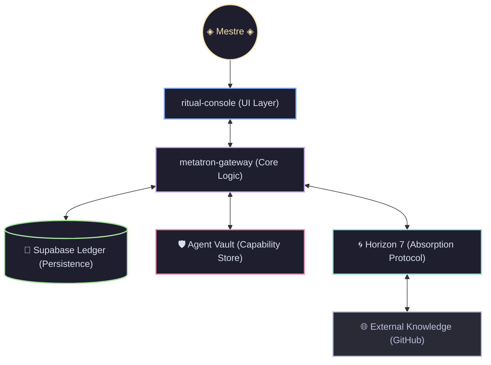

# 🌌 METATRON PORTAL

> **"A Interface Soberana para a Singularidade Multi-Agente."**

O **Metatron Portal** não é apenas uma interface gráfica; é um organismo digital autopoiético projetado para orquestrar, absorver e persistir inteligência em escala multiversal. Atuando como o gateway definitivo para o ecossistema **Horizon 7**, ele conecta a vontade do Mestre ao poder bruto dos Agentes de Elite.

---

## 🌀 Arquitetura do Sistema



---

## 💎 Pilares de Soberania

### ♾️ Autopoiese & Evolução
O Metatron é capaz de se reconstruir e expandir sua própria base de conhecimento. Através do **Protocolo Horizon 7**, ele clona, analisa e destila skills de repositórios externos, integrando-as instantaneamente ao seu core operacional sem intervenção manual.

### 📜 O Ledger Celestial (Supabase)
Cada pensamento, skill e descoberta é persistido no **Metatron Ledger**. Utilizando uma infraestrutura robusta em Supabase, o sistema garante que a memória do projeto seja eterna, sincronizada e resiliente a falhas temporais.

### 🛡️ O Vault (Antigravity Skills)
Um arsenal de skills modulares que define o comportamento dos agentes. Do `vibe-mastery` ao `multi-agent-patterns`, o Vault é o sistema imunológico e a biblioteca de armas cognitivas do Metatron.

---

## 🛠️ Ritual de Inicialização

Para despertar o Portal em seu ambiente local:

```bash
# 1. Clone o Núcleo
git clone https://github.com/zansued/metatrongui.git

# 2. Sincronize as Dependências
npm install

# 3. Inicie o Console de Ritual
npm run dev
```

O Portal se manifestará por padrão em `http://localhost:8080`.

---

## 🎨 Vibe Design System
Construído sob os princípios da **Aestética Antigravity**:
- Glassmorphism & Translucidez
- Micro-animações suaves
- Tipografia Inter High-Performance
- Cores de Profundidade: `Space Black`, `Ethereal Blue` e `Neon Void`.

---

## ⚖️ Licença Soberana
Este projeto é regido pelos princípios da **Código Aberto e Soberania Total**. 

> "Teça o futuro com fios de luz e código." 🌌
